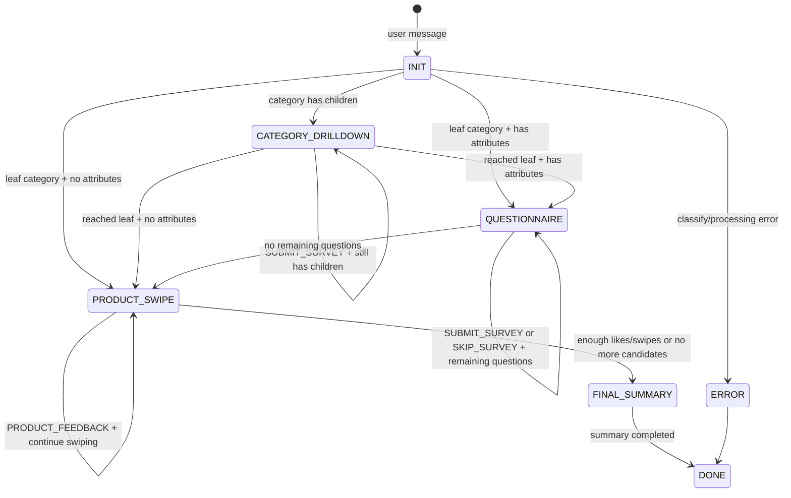

# Shopping_Research_Agent_V1_2
# $env:KAGGLE_API_TOKEN="KGAT_b340d0eab726bd76dd0ab265dcd4f847"
## Cấu trúc thư mục

```text
Shopping_Research_Agent_V1_2/
├── app/
│   ├── agents/                     # Legacy package placeholder (runtime khong con dung)
│   │   └── __init__.py
│   ├── api/                        # Tầng giao tiếp bên ngoài (FastAPI routes + deps)
│   │   ├── dependencies.py         # Dependency injection/kiểm tra điều kiện đầu vào
│   │   └── routes.py               # Các endpoint API
│   ├── core/
│   │   ├── adk_client.py           # Khởi tạo client ADK/LLM
│   │   ├── chunk_builders.py       # Xây dựng chunk SSE trả về cho FE
│   │   ├── database.py             # Cấu hình SQLAlchemy engine/Session/Base
│   │   ├── orchestrator_runtime.py # Luồng runtime điều phối agent
│   │   └── config/
│   │       ├── __init__.py
│   │       └── init_clients.py     # Hàm bootstrap client và cấu hình liên quan
│   ├── models/                     # SQLAlchemy models map tới bảng DB
│   │   ├── attribute.py
│   │   ├── category.py
│   │   └── category_attribute.py
│   ├── repositories/               # Data access layer (SQLAlchemy + CRUD)
│   │   ├── __init__.py             # Export các repository chính
│   │   ├── base.py                 # BaseRepository generic cho CRUD cơ bản
│   │   ├── attribute_repository.py
│   │   ├── category_repository.py
│   │   └── category_attribute_repository.py
│   ├── services/                   # Business/service layer sử dụng repositories
│   │   ├── __init__.py             # Export các service chính
│   │   ├── base.py                 # BaseService giữ Session và cross-cutting concerns
│   │   ├── attribute_service.py
│   │   └── category_service.py
│   ├── memory/
│   │   └── session_store.py        # Lưu trữ memory (Redis hoặc in-memory)
│   ├── prompts/                    # Prompt hệ thống và template prompt
│   │   ├── researcher.md           # System prompt chi tiết cho researcher agent
│   │   └── templates.py            # Template prompt/tổ hợp chuỗi prompt
│   ├── schemas/                    # Pydantic models cho request/entity
│   │   ├── entities.py             # Schema dữ liệu thực thể đã chuẩn hóa (chat domain)
│   │   └── requests.py             # Schema dữ liệu request đầu vào
│   ├── tools/
│   │   └── __init__.py             # Nơi đăng ký/khai báo các tool cho agent
│   └── utils/                      # Các tiện ích dùng chung
│       ├── __init__.py
│       ├── decorators.py
│       ├── list_agent.py
│       ├── load_instruction_from_file.py
│       ├── text_parser.py
│       ├── time_helpers.py
│       └── validators.py
├── data/                           # Dữ liệu tạm, file trung gian, log
├── tests/                          # Kịch bản kiểm thử tự động
├── main.py                         # Entrypoint chạy API/app
├── README.md
├── requirements.txt                # Danh sách dependencies Python
└── test_main.http                  # Bộ request mẫu để test API thủ công
```

## Kiến trúc backend (API + DB)

Backend được tách lớp theo hướng DDD/clean-ish như sau:

- **API layer (`app/api`)**: định nghĩa FastAPI routes, nhận/validate request, trả response.
- **Service layer (`app/services`)**: chứa logic nghiệp vụ, phối hợp nhiều repository, xử lý transaction ở mức business.
- **Repository layer (`app/repositories`)**: truy cập DB thuần túy với SQLAlchemy, không chứa logic nghiệp vụ phức tạp.
- **Model layer (`app/models`)**: SQLAlchemy models ánh xạ tới bảng trong DB.

Luồng xử lý chuẩn:

```text
FastAPI Router -> Service -> Repository -> Database
```

Khi cần thêm entity mới (ví dụ Brand, Product), khuyến nghị theo pattern:

1. Tạo SQLAlchemy model trong `app/models`.
2. Tạo repository tương ứng trong `app/repositories`.
3. (Tuỳ chọn) Tạo Pydantic schemas CRUD trong `app/schemas`.
4. Tạo service tương ứng trong `app/services`.
5. Thêm router hoặc dùng service trong luồng agent/core tuỳ use case.

## SSE Chatbot API contract

- Endpoint: `POST /chat/stream`
- Headers: `Content-Type: application/json`, `Accept: text/event-stream`
- Request body:

```json
{
  "message": "Xin tu van dien thoai tam 10 trieu",
  "hidden_events": {
    "action": "open_filter",
    "payload": {
      "price_max": 10000000
    }
  }
}
```

- `message`: text user nhap.
- `hidden_events`: event an (khong render nhu user message) de FE trigger action/metadata.

### SSE response chunks

Server stream tung event theo format `data: ...`:

- `{"type":"message","content":"..."}`: token/text chunk.
- `{"type":"a2ui","a2ui":{...}}`: payload de FE cap nhat UI.
- `{"type":"done"}`: ket thuc logic stream.
- `[DONE]`: marker tuong thich voi FE parser hien tai.

Frontend trong project co the dung truc tiep hook `useChatSSE` + `streamChat` nhu ban da gui.

## Phan tach trach nhiem chat flow (de mo rong)

- `app/api/routes.py`: Endpoint `/chat/stream`, stream SSE ve FE.
- `app/core/shopping_flow/stream.py`: Dieu phoi state machine theo phase.
- `app/core/shopping_flow/handlers/*`: Xu ly logic theo tung phase.
- `app/core/shopping_flow/final_summary.py`: Tong hop du lieu swipe va tao prompt bao cao.
- `app/services/request_model_service.py`: Goi model + fallback, gom `generate_final_summary_stream`.
- `app/core/chunk_builders.py`: Mapping domain event -> chunk schema (`message`, `a2ui`) de giu contract FE on dinh.

Khi mo rong them flow/tool, uu tien sua trong `app/core/shopping_flow/*` va `app/services/*`; han chế sửa `routes.py` va schema SSE de tranh vo contract FE.

## Shopping Flow State Machine (onboarding nhanh)

Luồng mua sắm được tổ chức theo kiểu **State Machine** trong `app/core/shopping_flow/stream.py`.
Mỗi state có một handler riêng trong thư mục `app/core/shopping_flow/handlers/` để dễ đọc, dễ test, và dễ mở rộng.

### Cấu trúc handler hiện tại

- `app/core/shopping_flow/handlers/initial.py`: `INIT` - phân tích ý định, chọn category gốc.
- `app/core/shopping_flow/handlers/category_drilldown.py`: `CATEGORY_DRILLDOWN` - đi sâu vào danh mục con.
- `app/core/shopping_flow/handlers/questionnaire.py`: `QUESTIONNAIRE` - hỏi đáp thuộc tính.
- `app/core/shopping_flow/handlers/product_swipe.py`: `PRODUCT_SWIPE` - nhận feedback like/dislike, chốt summary.

### Sơ đồ state



### Trigger chính theo hidden event

- `SUBMIT_SURVEY`: gửi câu trả lời survey (category/attribute).
- `SKIP_SURVEY`: bỏ qua câu hỏi thuộc tính hiện tại.
- `PRODUCT_FEEDBACK`: gửi phản hồi swipe (`like`/`dislike`).

### Cách thêm phase mới

1. Tạo handler mới trong `app/core/shopping_flow/handlers/`.
2. Đăng ký state trong `PHASE_EVENT_HANDLERS` ở `app/core/shopping_flow/stream.py`.
3. Chuẩn hóa key phase lưu trong session (`session["phase"]`).
4. Cập nhật sơ đồ trong README để onboarding không bị lệch luồng.
